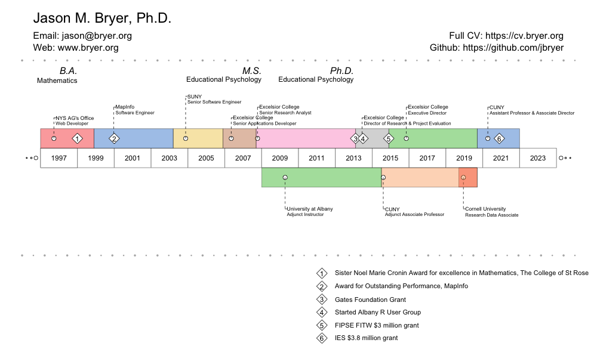

### Curriculum Vitae

[Click here to download the latest version of my CV](https://github.com/jbryer/CV/blob/master/Bryer_CV.pdf?raw=true)

#### Contact Information

Jason M. Bryer, Ph.D.  
Email: [jason@bryer.org](mailto:jason@bryer.org)  
Website: [jason.bryer.org](http://jason.bryer.org)  
CV: [cv.bryer.org](http://cv.bryer.org)  

#### Details on the repo

The PDF of my CV was built using the [`vitae`](https://github.com/mitchelloharawild/vitae) R package (with modifications contributed from [JooYoung Seo](https://github.com/jooyoungseo/jy_CV)) and the website using the [`blogdown`](https://bookdown.org/yihui/blogdown/) R package. The goal is to share the same data sources between these two different output formats. The repo is organized with the following files and folders:

* `index.Rmd` - The RMarkdown file to create a PDF of my CV.
* `config.Rmd` - The main configuration file for the `blogdown` site. This uses the [hugo-devresume-theme](https://github.com/cowboysmall-tools/hugo-devresume-theme) theme. This file needs to be built using the `knitr::knit('config.Rmd', output = 'site/config.toml')` command. This outputs a `config.toml` file into the `sites/` directory.
* `bib` - This directory contains BiBTeX files for publications and presentations.
* `data` - This directory contains Excel files with the various components of a CV (i.e. education, work experience, teaching experience, and awards).
* `docs` - Location where `blogdown` builds the website. This is where Github pages requires websites be built.
* `site` - The source files for the `blogdown` site.

